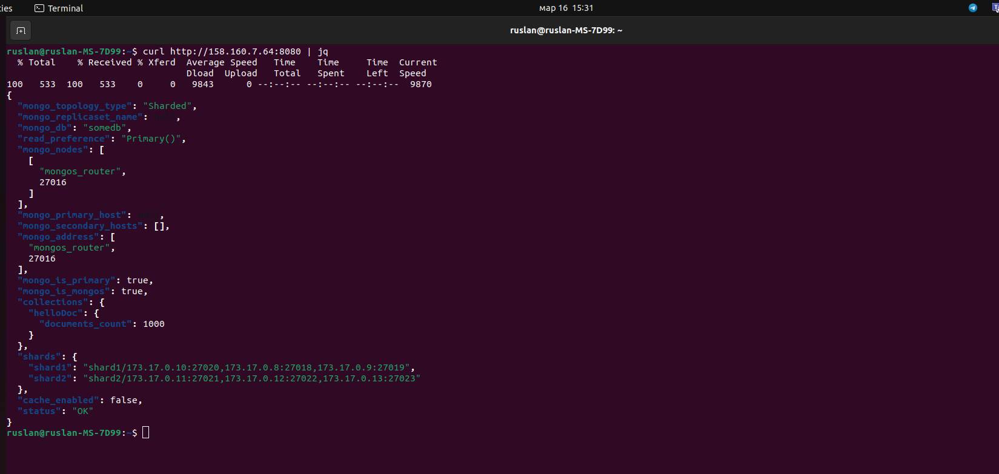

# Задание 5. Service Discovery и балансировка с API Gateway

Доступ на просмотр и комментирование:
https://drive.google.com/file/d/1tLimns0A9_5m1iyAuAgCemsYnsjSvVKv/view?usp=sharing

1. Скопируйте каталог на сервер, выдайте права на запуск скриптов bash

```
chmod +x init-mongodb.sh
chmod +x init-api-gateway.sh
```

2. Запустите установку сервисов

```
docker compose -f api-gateway.yaml up -d
```

3. Запустите скрипт инициализации MongoDB 

```
./init-mongodb.sh
```

4. Запустите скрипт инициализации API Gateway 

```
./init-api-gateway.sh
```

5. Выполните запрос к приложению

```
curl http://<ip_address>:9080 | jq
```

```
curl http://<ip_address>:9080/helloDoc/users | jq
```

