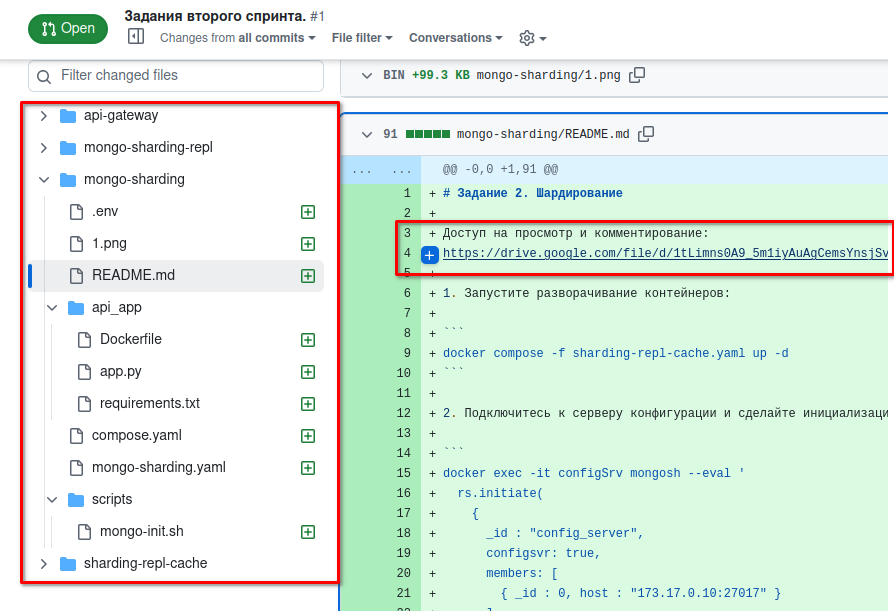

Привет Иван, была обратная связь
```
Руслан, привет!
Часть 1
Не нашел ни ссылки, ни файла диаграммы.
Часть 2
- В README.md проекта есть чёткая инструкция по запуску проекта.
- Удобные скрипты для настройки.
- Все сервисы запускаются успешно, приложение открывается в браузере и отображает JSON с информацией о MongoDB
```

Разъяснения



1. Каждому заданию соответствует своя папка (в соответствии с заданием)
2. В каждой папке есть свой файл README.md с описанием шагов запуска и ссылкой на схему в начале файла
3. В первом задании сделан "ручной запуск", в последующих автоматизировано с помощью bash-скриптов
4. Дополнительно выгрузил и приложил диаграмму в корень