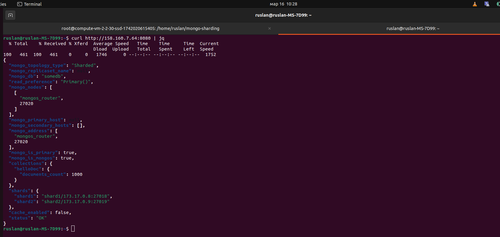

# Задание 2. Шардирование

Доступ на просмотр и комментирование:
https://drive.google.com/file/d/1tLimns0A9_5m1iyAuAgCemsYnsjSvVKv/view?usp=sharing

1. Запустите разворачивание контейнеров:

```
docker compose -f sharding-repl-cache.yaml up -d
```

2. Подключитесь к серверу конфигурации и сделайте инициализацию:

```
docker exec -it configSrv mongosh --eval '
  rs.initiate(
    {
      _id : "config_server",
      configsvr: true,
      members: [
        { _id : 0, host : "173.17.0.10:27017" }
      ]
    }
  );
'
```

До этой инициализации компонент mongos_router будет сыпать ошибками в логах.
Чтобы посмотреть статус можно выполнить:
```
docker exec -it configSrv mongosh --eval 'rs.status()'
```

3. Инициализируйте шарды:

Первый шард:
```
docker exec -it mongodb_shard1 mongosh --port 27018 --eval '
rs.initiate(
    {
      _id : "shard1",
      members: [
        { _id : 0, host : "173.17.0.8:27018" }
      ]
    }
);
'
```

Второй шард:
```
docker exec -it mongodb_shard2 mongosh --port 27019 --eval '
rs.initiate(
    {
      _id : "shard2",
      members: [
        { _id : 0, host : "173.17.0.9:27019" }
      ]
    }
);
'
```

4. Инцициализируйте роутер и наполните его тестовыми данными:

```
docker exec -it mongos_router mongosh --port 27020 --eval '
  sh.addShard("shard1/173.17.0.8:27018");
  sh.addShard("shard2/173.17.0.9:27019");
  sh.enableSharding("somedb");
  sh.shardCollection("somedb.helloDoc", { "name" : "hashed" });

  var db = connect("mongodb://mongos_router:27020/somedb");

  for (var i = 0; i < 1000; i++) {
    db.helloDoc.insert({ age: i, name: "ly" + i });
  }

  var count = db.helloDoc.countDocuments();
  print("Document count: " + count);
'

```

5. Выполните запрос к приложению, размещенного на порту 8080:

```
curl http://158.160.7.64:8080 | jq
```

