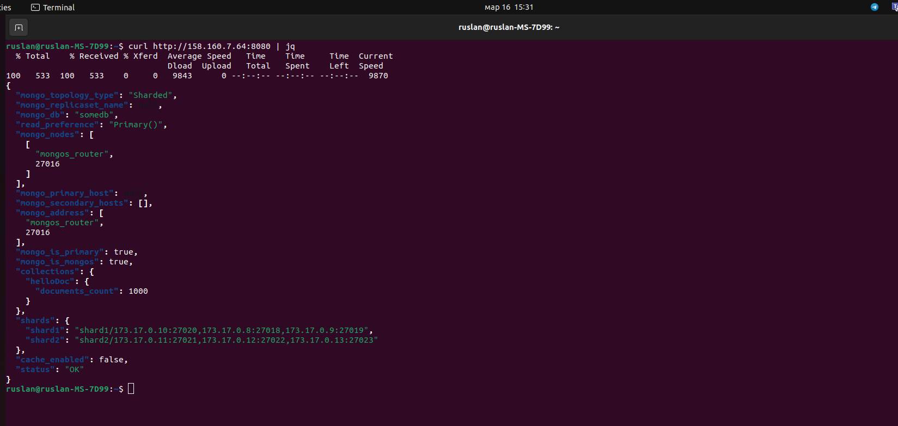

# Задание 4. Кеширование

Доступ на просмотр и комментирование:
https://drive.google.com/file/d/1tLimns0A9_5m1iyAuAgCemsYnsjSvVKv/view?usp=sharing

1. Запустите разворачивание контейнеров:

```
docker compose -f sharding-repl-cache.yaml up -d
```

2. Запустите скрипт init.sh

3. Выполните запрос к приложению, размещенного на порту 8080:

```
curl http://158.160.7.64:8080 | jq
```

```
curl http://158.160.7.64:8080/helloDoc/users | jq
```

